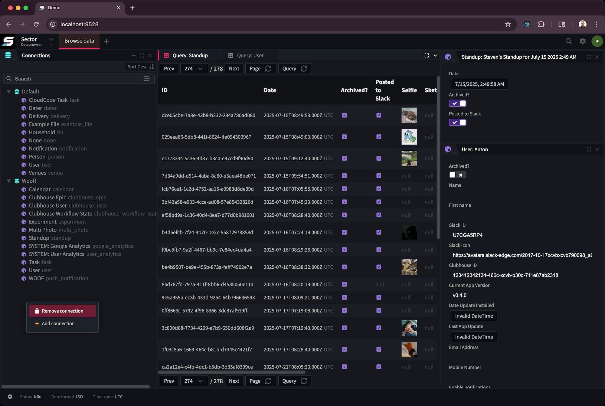

# Sector

Sector is both a standalone & self-hostable data-browser for the JourneyApps platform
and a set of core modules that are intended to be integrated in the currently
proprietary OXIDE IDE.

__Note: Sector is still considered a work-in-progress, and while safe to use for read-only scenarios, 
we do not recommend using Sector for situations where writes are required.__

## Run Locally

1. Clone repo!
2. `pnpm install` in the root directory
3. `pnpm build` in the root directory
4. `cd ./server && pnpm watch`
5. Navigate to [http://localhost:9528](http://localhost:9528)

## Release

Release is done using changesets. Once a changeset is added, a release branch is created and upon merging,
all changed packages are built and published automatically.